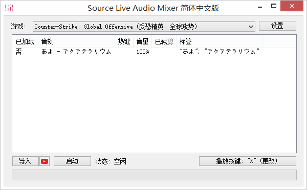
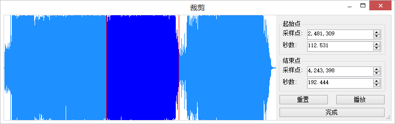
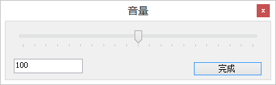

# SLAM 简体中文版

[Source Live Audio Mixer 首页 (英文版)](http://slam.flankers.net/)

[Twitter](https://twitter.com/SilentFL)

[Reddit](https://www.reddit.com/r/SourceLiveAudioMixer/)

SLAM 是一种通过起源引擎游戏内置的通讯系统与朋友分享音频的新方式. 依靠 SLAM 的极简设计, 仅需超短时间即可取悦听众! 

目前的功能:
- 简单的游戏内界面.
- 按照音轨或者标签选择音轨.
- 只需点击一次按钮即可导入多个媒体文件 (.mp3, .wav, .aac, .wma, .m4a, .mp4, .wmv, .avi, .m4v 与 .mov 文件类型).
- 从 YouTube 链接导入音轨.
- 支持多种游戏, 例如: Counter-Strike: Global Offensive (反恐精英: 全球攻势), Counter-Strike: Source (反恐精英: 起源) 与 Team Fortress 2 (军团要塞 2)
- 支持绑定热键加载特定歌曲.
- 支持播放时更改音轨音量.
- 支持播放时裁剪音轨.

